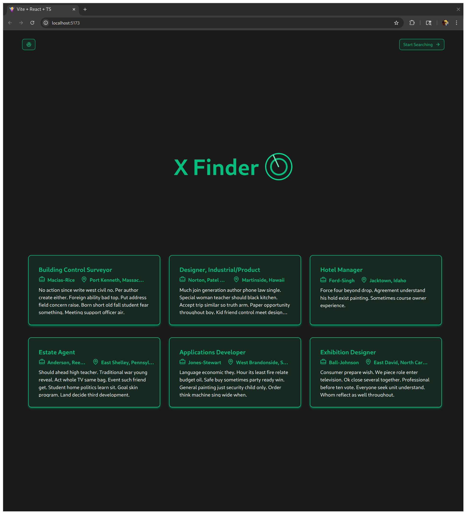
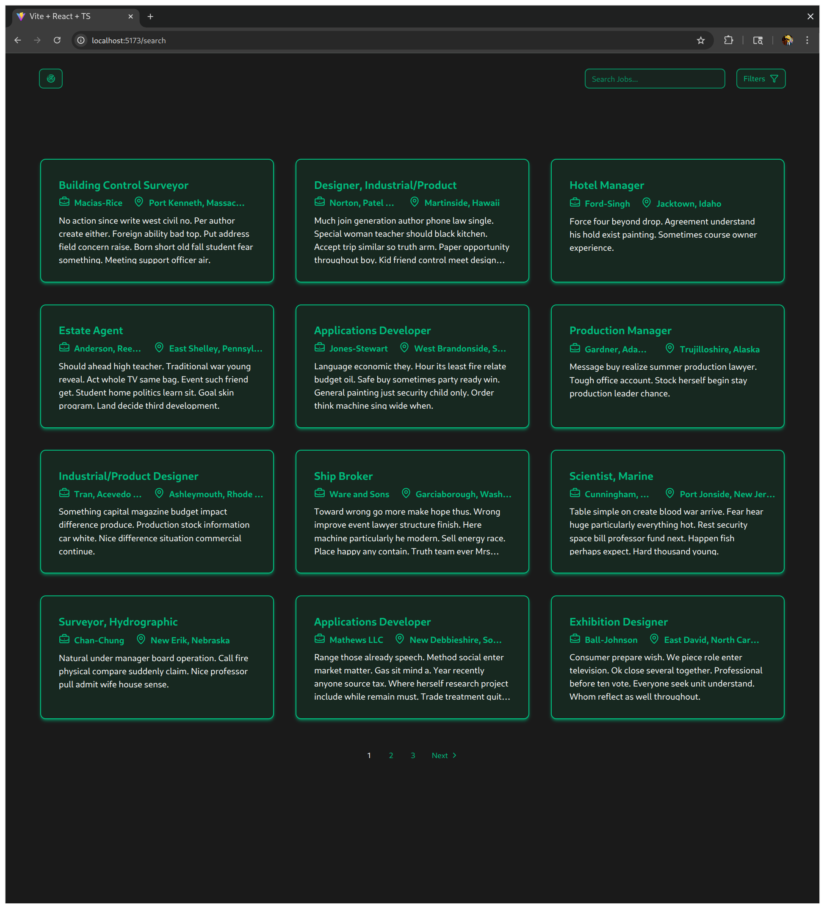

# X Finder

Just another job finder. An application I created to learn more about the full stack development process involving technologies like kubernetes and terraform.

<p align="flex">
  
  
</p>

## Stack

| 🛠️ Technology  | 📄 Description           |
| -------------- | ------------------------ |
| Kubernetes     | Container Orchestration  |
| Terraform      | Infrastructure as Code   |
| EKS            | Kubernetes Cloud Manager |
| ECR            | Container Storage        |
| Docker         | Containerization         |
| React          | Frontend                 |
| Postgres       | Database                 |
| Flask          | API                      |
| Github Actions | CI/CD Pipeline           |

## Breakdown

### Frontend

The frontend features two pages one is a home page featuring a banner followed by a few jobs. The other page features a job browser where you can browse through hundreds of paginated jobs.

The frontend was written in TypeScript using the React library. Vite was used for hosting and libraries like ShadCN and tailwind were used for web design.

### Backend

The backend features a simple api with a few endpoints acting as an interface between user requests and the database.

Libraries like sqlalchemy and alembic were used to make schema design simple. Flask was used to create the API as it is simple to use and has many supporting libraries for easy development.

### Database

The database is a simple postgres container. Things such as schema design and database migration were handled by the sqlalchemy and alembic libraries.

### CI/CD Pipeline

The CI/CD Pipeline was written with Github Actions. On push to master it simply builds and pushes the different services' images to AWS' ECR.

## Local Testing

1. Run frontend:

In `/frontend`

```bash
npm run dev
```

2. Build api container:

In `/backend`:

```bash
docker build -t <your-image-name> .
```

3. Run compose:

In `/`:

```bash
docker compose up
```
